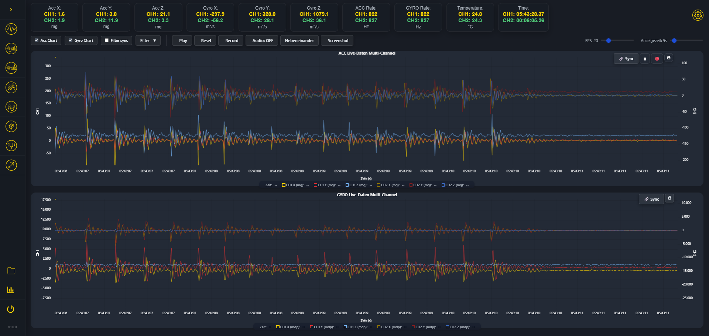
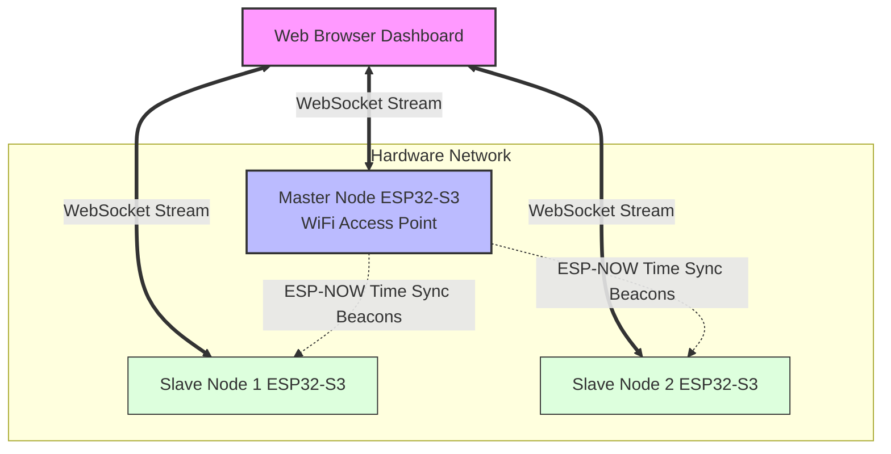

*Languages: [English](README.md) | [Deutsch](README_DE.md)*

# SenzIMU Multichannel – ESP32-S3 Multi-Node IMU Dashboard

 -orange)  

> **Zero-Latency 3D Tracking & Vibration Analysis right in your browser. Fully synchronized.**
> 
> <div align="center">
>   <!-- PLACEHOLDER: Insert a short GIF (3D Tracking) or a Hero image here -->
>   
> </div>

## What is SenzIMU and what can it do?

SenzIMU Multichannel is a wireless, standalone **sensor network for real-time motion and vibration analysis**. 

You attach multiple tiny sensor nodes to any objects, machines, or body parts. One of the nodes automatically creates its own WiFi network and serves a complete web dashboard. Opening this dashboard on a laptop, tablet, or smartphone allows you to see exactly what all sensors are doing **in real-time and perfectly synchronized**. **Entirely without clouds, servers, or app installations.**

### What the system actually does:

1. **Live 3D Tracking (Kinematics & Orientation)**
   The system calculates the exact spatial orientation (quaternions) and kinematic translation (movement in space) of all connected sensors from the raw data. These are animated live in the browser as 3D models. If you move a sensor in the real world, the model on the screen moves instantly with zero latency.
   <br>

2. **Vibration, Frequency & Modal Analysis**
   The sensors support a **variable sampling rate from 26 to 6660 Hz** (e.g., using the [LSM6DSO](https://www.st.com/en/mems-and-sensors/lsm6dso.html)). The web dashboard uses this to calculate a Fast Fourier Transform (FFT) in real-time, displaying high-resolution frequency spectra and **waterfall spectrograms**. By capturing synchronized data across multiple points simultaneously, the system enables comprehensive **modal analysis** to determine natural frequencies and mode shapes of machines and structures.
   <br>

3. **Comparative Sensor Diagnostics**
   All sensors in the network are synchronized down to the microsecond. The high-performance live charts allow you to overlay and exactly compare the acceleration and gyroscope values of multiple sensors. You immediately spot the slightest delays or deviations between different objects.
   <br>

4. **Live Calibration (Over-the-Air)**
   Each sensor can be calibrated directly from the dashboard. Parameters like gyroscope offsets, scaling, or gravity cutoffs can be measured at the push of a button and permanently saved on the respective sensor node.

5. **Sleep-Wake Mechanics for Standalone Operation**
   The nodes can operate in an extremely power-efficient manner and wake up just by being touched (utilizing the touch sensors of the ESP32-S3). This means they can remain permanently installed in devices without instantly draining the battery, waking up only when requested by the web dashboard or physical movement.

---

## 🎯 Practical Use Cases

- **Machine Monitoring (Predictive Maintenance):** Attach sensors to various components of a machine. The live spectrogram immediately reveals unexpected vibrations or deviating frequencies before a failure occurs.
- **Biomechanics & Motion Capture:** Synchronized tracking of multiple limbs. Thanks to the highly precise time synchronization, exact movement sequences can be diagnosed (e.g., in sports).
- **Robotics Prototyping:** Quickly analyze the vibration and motion behavior of robotic arms or chassis without complex wiring harnesses.

---

## 🛠️ Technical Features & Architecture

To enable this performance directly in the browser, the system utilizes state-of-the-art embedded and web technologies:

### 📡 Multi-Node Sensor Network



- **WiFi & ESP-NOW Hybrid**: Automatic role distribution into master and slave nodes. The master acts as a WiFi Access Point and serves the web dashboard. However, **every single node** (master and slaves alike) runs its own dedicated WebSocket server. The browser establishes a direct point-to-point connection to each sensor to stream data in parallel without bottlenecks. ESP-NOW is used **exclusively** for time synchronization.
- **Microsecond Time-Sync**: Precise, network-wide time synchronization via ESP-NOW beacons to prevent drift between the nodes.

### 🚀 High-Performance Firmware (C++ / ESP-IDF)
- **Zero-Copy & StreamBuffers**: Efficient data processing in the ESP32-S3 using FreeRTOS `StreamBuffer`, minimized heap allocations, and binary WebSocket streaming.
- **Hardware Touch-Wakeup**: Advanced sleep management including ESP32-S3 Touch FSM for extremely power-efficient battery operation.

### 💻 Advanced Web Dashboard (Frontend)
The web frontend, served entirely locally from the ESP32 (via LittleFS), provides a desktop-class analysis environment:
- **Real-Time Charts**: Latency-free plotting of massive datasets using **uPlot**.
- **WebWorker Architecture**: Massive offloading of computationally intensive tasks (decoding, sensor fusion, RMS calculation, filter algorithms) to dedicated background workers (`fusion-worker.js`, `decode-worker.js`) to guarantee a buttery-smooth 60fps UI.
- **Three.js**: For 3D kinematics visualization including GLTF model support.

---

## 🚀 Getting Started

### Installation & Flashing
1. **Clone the repository**
   ```bash
   git clone https://github.com/simenz85/senzIMU_multichannel.git
   cd senzIMU_multichannel
   ```
2. **Open the project**
   Open the folder in VS Code with the **PlatformIO** extension active.
3. **Flash the filesystem (The Web UI)**
   Run `Upload File System image` in PlatformIO (`pio run -t uploadfs`) to flash the contents of the `data/` folder (the dashboard) to the ESP32.
4. **Flash the firmware**
   Run the `Upload` task (`pio run -t upload`).
5. **Connect & Test**
   After rebooting, the master ESP will host a WiFi network (`senzIMU`). Connect to it and open `http://192.168.4.1` in your browser.

---

## 🤝 Contributing & License
We welcome bug reports and feedback. Please note that computationally heavy UI logic must always be offloaded to WebWorkers.

This project is licensed under the **Creative Commons Attribution-NonCommercial-ShareAlike 4.0 International (CC BY-NC-SA 4.0)** license. Anyone is welcome to publicly download, install, modify, fork, and redistribute the software for personal, academic, or hobbyist purposes. However, **any commercial use is strictly prohibited**. If you remix, transform, or build upon the material, you must distribute your contributions under the same license. Further details can be found in the `LICENSE` file.
