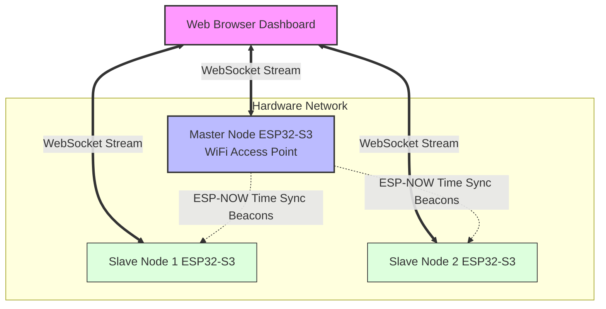

*Sprachen: [English](README.md) | [Deutsch](README_DE.md)*

# SenzIMU Multichannel – ESP32-S3 Multi-Node IMU Dashboard

 -orange)  

> **Zero-Latency 3D Tracking & Vibration Analysis right in your browser. Fully synchronized.**
> 
> <div align="center">
>   <!-- PLATZHALTER: Füge hier ein kurzes GIF (3D Tracking) oder ein Hero-Bild ein -->
>   
> </div>

## Was ist SenzIMU und was kann es?

SenzIMU Multichannel ist ein kabelloses, autarkes **Sensor-Netzwerk zur Echtzeit-Bewegungs- und Vibrationsanalyse**. 

Man befestigt mehrere winzige Sensorknoten (Nodes) an beliebigen Objekten, Maschinen oder Körperteilen. Einer der Knoten spannt automatisch ein eigenes WLAN-Netzwerk auf und liefert ein komplettes Web-Dashboard aus. Öffnet man dieses Dashboard auf einem Laptop, Tablet oder Smartphone, sieht man **in Echtzeit und zeitsynchron**, was alle Sensoren gerade tun. **Ganz ohne Cloud, Server oder App-Installation.**

### Was das System konkret leistet:

1. **Live 3D-Tracking (Kinematik & Orientierung)**
   Das System berechnet aus den Rohdaten die exakte räumliche Ausrichtung (Quaternions) und kinematische Translation (Bewegung im Raum) aller verbundenen Sensoren. Diese werden im Browser live als 3D-Modelle animiert. Bewegt man einen Sensor in der echten Welt, bewegt sich das Modell auf dem Bildschirm latenzfrei mit.
   <br>

2. **Vibrations-, Frequenz- & Modalanalyse**
   Die Sensoren unterstützen eine **variable Abtastrate von 26 bis 6660 Hz** (z. B. mit dem [LSM6DSO](https://www.st.com/en/mems-and-sensors/lsm6dso.html)). Das Web-Dashboard berechnet daraus in Echtzeit eine Fast-Fourier-Transformation (FFT) und zeigt hochauflösende Frequenzspektren sowie **Wasserfall-Spektrogramme** an. Durch die synchronisierte Aufzeichnung an mehreren Punkten gleichzeitig ermöglicht das System eine umfassende **Modalanalyse** zur Bestimmung von Eigenfrequenzen und Schwingungsformen von Maschinen und Strukturen.
   <br>

3. **Vergleichende Sensordiagnostik**
   Alle Sensoren im Netzwerk sind auf die Mikrosekunde genau synchronisiert. Die hochperformanten Live-Diagramme erlauben es, die Beschleunigungs- und Gyroskop-Werte mehrerer Sensoren übereinanderzulegen und exakt zu vergleichen. Du erkennst sofort kleinste Verzögerungen oder Abweichungen zwischen unterschiedlichen Objekten.
   <br>

4. **Live-Kalibrierung (Over-the-Air)**
   Jeder Sensor lässt sich direkt aus dem Dashboard heraus kalibrieren. Parameter wie Gyroskop-Offsets, Skalierung oder Gravity-Cutoffs können per Knopfdruck gemessen und dauerhaft auf den jeweiligen Sensorknoten gespeichert werden.

5. **Sleep-Wake-Mechanik für autarken Betrieb**
   Die Knoten können extrem stromsparend arbeiten und sich durch bloßes Berühren (Touch-Sensoren des ESP32-S3) wieder aufwecken. Dadurch können sie in Geräten fest verbaut bleiben, ohne den Akku sofort zu leeren, und wachen nur auf, wenn das Web-Dashboard oder eine Bewegung dies anfordert.

---

## 🎯 Praktische Anwendungsfälle (Use Cases)

- **Maschinenüberwachung (Predictive Maintenance):** Befestigung von Sensoren an verschiedenen Bauteilen einer Maschine. Das Live-Spektrogramm offenbart sofort unerwartete Vibrationen oder abweichende Frequenzen, bevor ein Defekt auftritt.
- **Biomechanik & Motion Capture:** Synchronisiertes Tracking mehrerer Gliedmaßen. Durch die hochpräzise Zeitsynchronisation lässt sich der exakte Bewegungsablauf diagnostizieren (z. B. im Sport).
- **Robotik-Prototyping:** Schnelles Analysieren des Schwingungs- und Bewegungsverhaltens von Roboterarmen oder Fahrwerken ohne komplexe Kabelbäume.

---

## 🛠️ Technische Kernfeatures & Architektur

Um diese Leistung direkt im Browser zu ermöglichen, nutzt das System modernste Embedded- und Web-Technologien:

### 📡 Multi-Node Sensor-Netzwerk



- **WiFi & ESP-NOW Hybrid**: Automatische Rollenverteilung in Master und Slave-Knoten. Der Master fungiert als WiFi Access Point und liefert das Web-Dashboard aus. **Jeder Knoten** (sowohl Master als auch Slaves) betreibt jedoch einen eigenen, dedizierten WebSocket-Server. Der Browser baut zu jedem Sensor eine direkte Punkt-zu-Punkt-Verbindung auf, um Daten ohne Flaschenhals parallel zu streamen. ESP-NOW wird **ausschließlich** für die Zeitsynchronisation genutzt.
- **Microsecond Time-Sync**: Präzise, netzwerkweite Zeitsynchronisation über ESP-NOW Beacons zur Vermeidung von Drift zwischen den Knoten.

### 🚀 Hochleistungs-Firmware (C++ / ESP-IDF)
- **Zero-Copy & StreamBuffers**: Effiziente Datenverarbeitung im ESP32-S3 mittels FreeRTOS `StreamBuffer`, minimierte Heap-Allokationen und binäres WebSocket-Streaming.
- **Hardware-Touch-Wakeup**: Fortschrittliches Sleep-Management inklusive ESP32-S3 Touch FSM für extrem stromsparenden Batteriebetrieb.

### 💻 Erweitertes Web-Dashboard (Frontend)
Das vollständig lokal vom ESP32 (via LittleFS) ausgelieferte Web-Frontend bietet eine Desktop-Klasse Analyse-Umgebung:
- **Echtzeit-Diagramme**: Latenzfreies Plotting großer Datenmengen mithilfe von **uPlot**.
- **WebWorker Architektur**: Massive Auslagerung rechenintensiver Aufgaben (Decodierung, Sensor-Fusion, RMS-Kalkulation, Filter-Algorithmen) in dedizierte Background-Worker (`fusion-worker.js`, `decode-worker.js`), um ein butterweiches 60fps UI zu garantieren.
- **Three.js**: Für die 3D Kinematik-Visualisierung inkl. GLTF-Modellunterstützung.

---

## 🚀 Getting Started

### Installation & Flashen
1. **Repository klonen**
   ```bash
   git clone https://github.com/simenz85/senzIMU_multichannel.git
   cd senzIMU_multichannel
   ```
2. **Projekt öffnen**
   Öffne den Ordner in VS Code mit aktiver **PlatformIO** Extension.
3. **Dateisystem flashen (Das Web-UI)**
   Führe in PlatformIO `Upload File System image` aus (`pio run -t uploadfs`), um den Inhalt des `data/` Ordners (das Dashboard) auf den ESP32 zu flashen.
4. **Firmware flashen**
   Führe den `Upload` Task aus (`pio run -t upload`).
5. **Verbinden & Testen**
   Nach dem Neustart spannt der Master-ESP ein WLAN-Netzwerk auf (`senzIMU`). Verbinde dich damit und öffne `http://192.168.4.1` im Browser.

---

## 🤝 Mitwirken & Lizenz
Wir freuen uns über Bugreports und Feedback. Bitte beachte, dass rechenintensive UI-Logik immer in WebWorker ausgelagert werden muss.

Dieses Projekt ist unter der **Creative Commons Attribution-NonCommercial-ShareAlike 4.0 International (CC BY-NC-SA 4.0)** Lizenz lizenziert. Jeder ist eingeladen, die Software öffentlich herunterzuladen, zu modifizieren, zu forken und weiterzuverbreiten, solange dies für private, akademische oder hobbymäßige Zwecke geschieht. Jedoch ist **jede kommerzielle Nutzung strengstens untersagt**. Wenn das Material remixt, verändert oder darauf aufgebaut wird, müssen die eigenen Beiträge unter derselben Lizenz wie das Original verbreitet werden. Weitere Details findest du in der `LICENSE` Datei.
