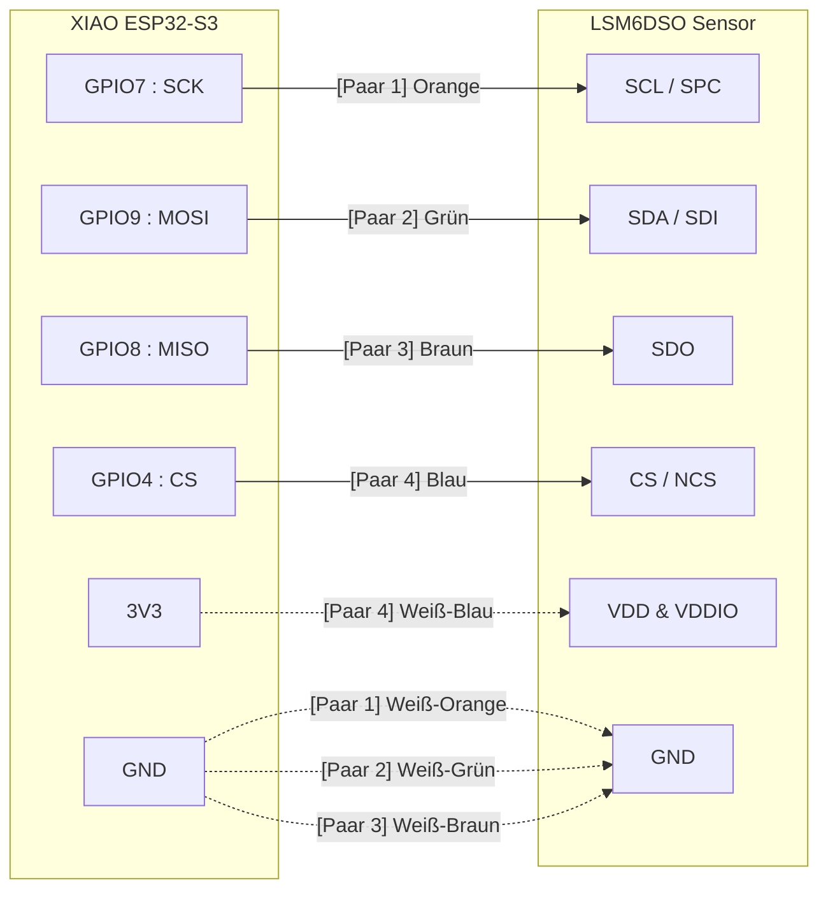

# SPI ueber Distanz

## Ziel

Diese Datei enthaelt dieselbe Verdrahtungsinformation in drei Formen:
- als Mermaid-Diagramm
- als Tabelle
- als ASCII-Fallback

Wenn Mermaid in der Markdown-Vorschau nicht angezeigt wird, kannst du die Tabelle oder die ASCII-Darstellung direkt verwenden. Die GPIO-Zuordnung unten entspricht der aktuellen Firmware in src/main.cpp.

## Mermaid



## Verdrahtungstabelle

| Paar | Farbe | XIAO ESP32-S3 | Sensor | Rueckleiter |
|---|---|---|---|---|
| 1 | Orange / Weiß-Orange | GPIO7 : SCK | SCL / SPC | GND |
| 2 | Grün / Weiß-Grün | GPIO9 : MOSI | SDA / SDI | GND |
| 3 | Braun / Weiß-Braun | GPIO8 : MISO | SDO | GND |
| 4 | Blau / Weiß-Blau | GPIO4 : CS und 3V3 | CS / NCS und VDD & VDDIO | 3V3 |

## ASCII-Fallback

```text
XIAO ESP32-S3                        LSM6DSO Sensor
----------------------------        ----------------------------
GPIO7 : SCK       --------------->  SCL / SPC
GND  / Rueckweg   - - - - - - - ->  GND

GPIO9 : MOSI      --------------->  SDA / SDI
GND  / Rueckweg   - - - - - - - ->  GND

GPIO8 : MISO      --------------->  SDO
GND  / Rueckweg   - - - - - - - ->  GND

GPIO4 : CS        --------------->  CS / NCS
3V3  / Versorgung - - - - - - - ->  VDD & VDDIO
```

## Paar-Zuordnung

1. Paar 1: Orange an GPIO7 : SCK, Weiß-Orange an GND.
2. Paar 2: Grün an GPIO9 : MOSI, Weiß-Grün an GND.
3. Paar 3: Braun an GPIO8 : MISO, Weiß-Braun an GND.
4. Paar 4: Blau an GPIO4 : CS, Weiß-Blau an 3V3 beziehungsweise VDD & VDDIO.

## Firmware-Bezug

- SCK = GPIO7
- MISO = GPIO8
- MOSI = GPIO9
- CS = GPIO4

## Hinweis

SPI ist fuer kurze Strecken gedacht. Bei laengeren Kabeln helfen verdrillte Paare mit nah gefuehrtem Rueckleiter dabei, Stoerungen und Uebersprechen zu reduzieren.