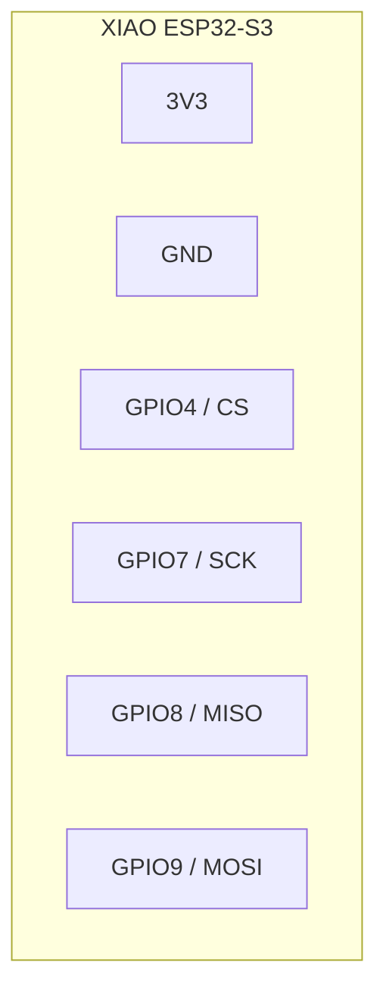
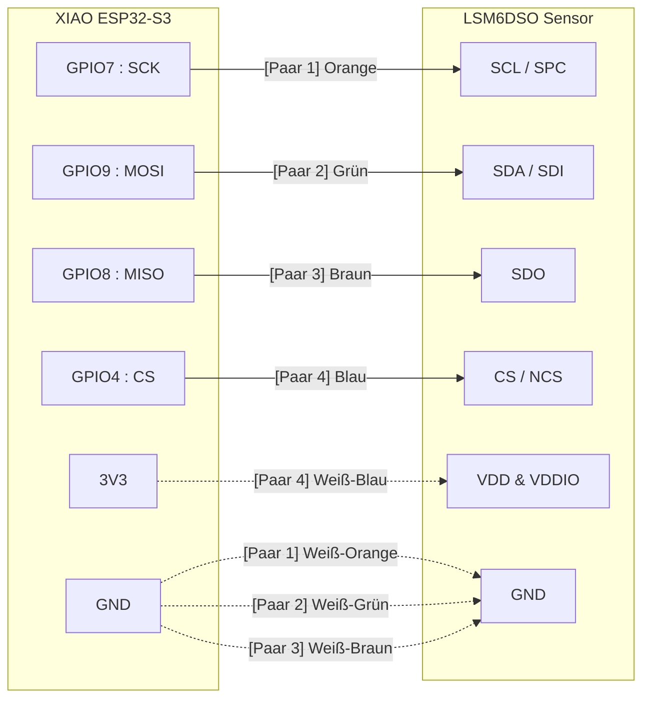

# Die Herausforderung: SPI über Distanz

SPI (Serial Peripheral Interface) ist eigentlich für die Kommunikation über wenige Zentimeter auf einer Platine gedacht. Nutzt du ein längeres LAN-Kabel, werden die Leitungskapazität und das Übersprechen (Crosstalk) zwischen den hochfrequenten Signalen zum Problem.

Um das zu lösen, machen wir uns die Struktur des LAN-Kabels zunutze. Jedes Adernpaar ist verdrillt (Twisted Pair). Wenn wir jedes schnelle Datensignal (SCK, MOSI, MISO) mit einer eigenen Masseleitung (GND) verdrillen, fangen wir Störsignale ab und geben dem Strom einen direkten Rückweg.

## Der Verdrahtungsplan

Hier ist die visuelle Darstellung der Verkabelung passend zur aktuellen Firmware in src/main.cpp. Du bündelst auf der Seite des XIAO drei weiße Adern und verbindest sie mit dem einzigen GND-Pin. Dasselbe machst du auf der Seite des Sensors.

## XIAO Pin-Schema

Die folgende Skizze ist keine komplette Pinout-Grafik des Boards, sondern eine vereinfachte Schemaansicht mit den fuer diese SPI-Verdrahtung relevanten Anschluessen.

## XIAO Pinout Referenzbild

Das folgende Referenzbild zeigt die XIAO-ESP32-S3-Pinbelegung als Board-Pinout.


```text
        XIAO ESP32-S3
    ---------------------
    | 3V3            GND |
    |                   |
    | GPIO4   -> CS     |
    | GPIO7   -> SCK    |
    | GPIO8   -> MISO   |
    | GPIO9   -> MOSI   |
    ---------------------
```

## Schema als Diagramm



## Code-Snippet



## Paar-Zuordnung

1. Paar 1 (Orange): GPIO7 an SCL/SPC. Das weiße Kabel an GND.
2. Paar 2 (Grün): GPIO9 an SDA/SDI. Das weiße Kabel an GND.
3. Paar 3 (Braun): GPIO8 an SDO. Das weiße Kabel an GND.
4. Paar 4 (Blau): GPIO4 an CS/NCS. Das weiße Kabel an 3V3 (XIAO) bzw. VDD/VDDIO (Sensor).

## Firmware-Bezug

Die aktuelle Zuordnung stammt direkt aus src/main.cpp:

- SCK = GPIO7
- MISO = GPIO8
- MOSI = GPIO9
- CS = GPIO4
