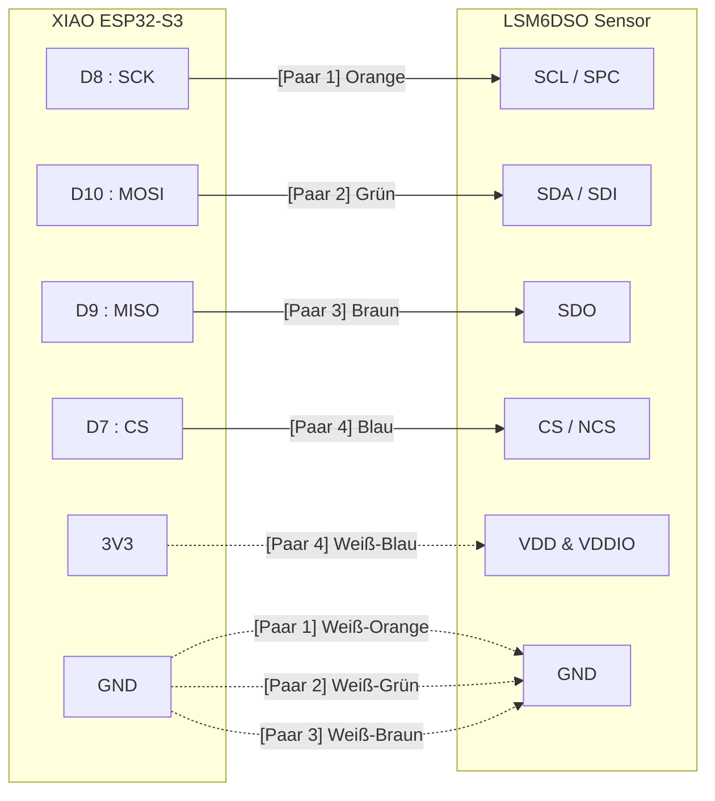

# Die Herausforderung: SPI über Distanz

SPI (Serial Peripheral Interface) ist eigentlich für die Kommunikation über wenige Zentimeter auf einer Platine gedacht. Nutzt du ein längeres LAN-Kabel, werden die Leitungskapazität und das Übersprechen (Crosstalk) zwischen den hochfrequenten Signalen zum Problem.

Um das zu lösen, machen wir uns die Struktur des LAN-Kabels zunutze. Jedes Adernpaar ist verdrillt (Twisted Pair). Wenn wir jedes schnelle Datensignal (SCK, MOSI, MISO) mit einer eigenen Masseleitung (GND) verdrillen, fangen wir Störsignale ab und geben dem Strom einen direkten Rückweg.

## Der Verdrahtungsplan

Hier ist die visuelle Darstellung der Verkabelung. Du bündelst auf der Seite des XIAO drei weiße Adern und verbindest sie mit dem einzigen GND-Pin. Dasselbe machst du auf der Seite des Sensors.

## Code-Snippet

## Paar-Zuordnung

1. Paar 1 (Orange): D8 an SCL/SPC. Das weiße Kabel an GND.
2. Paar 2 (Grün): D10 an SDA/SDI. Das weiße Kabel an GND.
3. Paar 3 (Braun): D9 an SDO. Das weiße Kabel an GND.
4. Paar 4 (Blau): D7 an CS/NCS. Das weiße Kabel an 3V3 (XIAO) bzw. VDD/VDDIO (Sensor).
